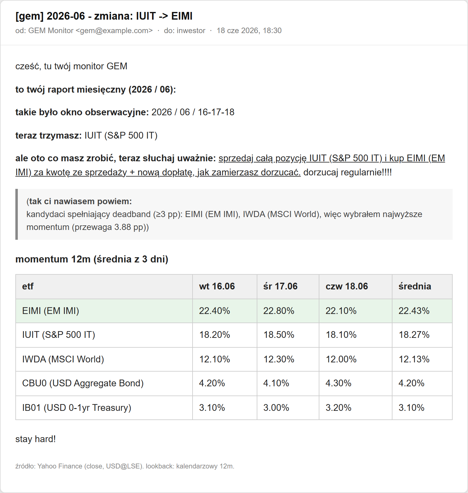
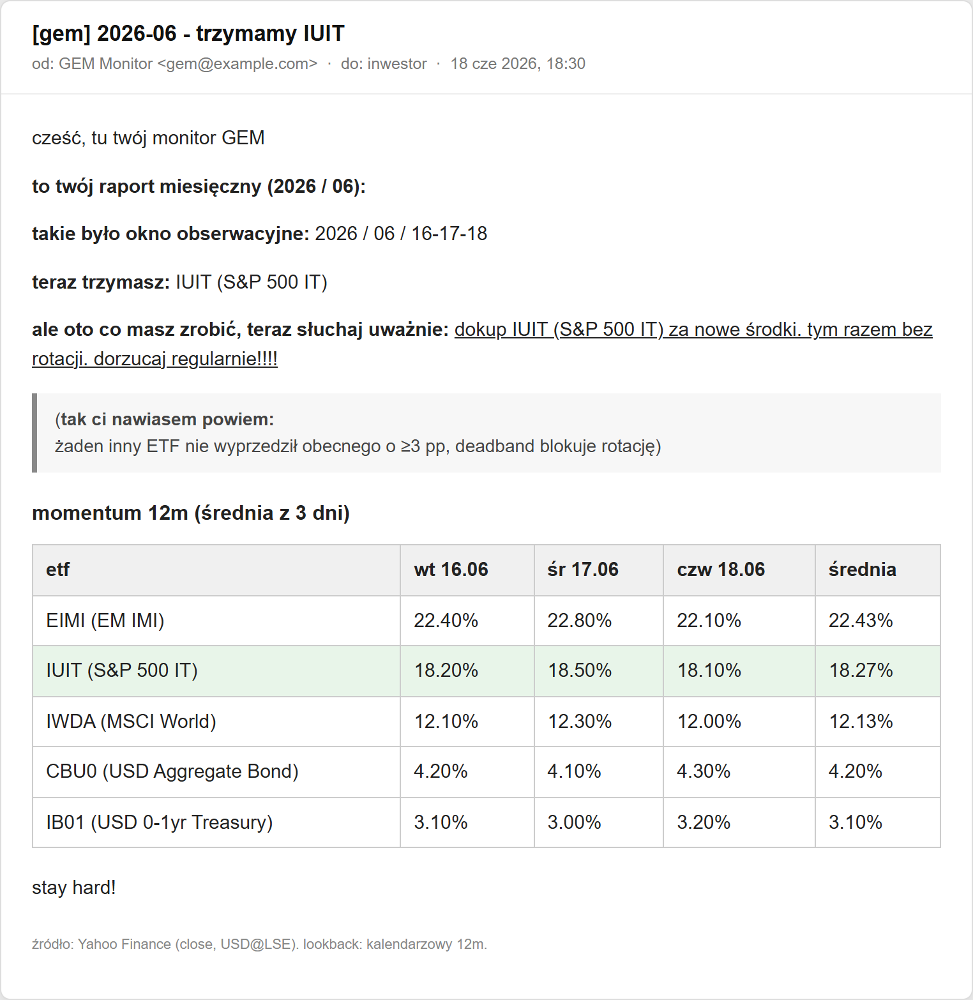
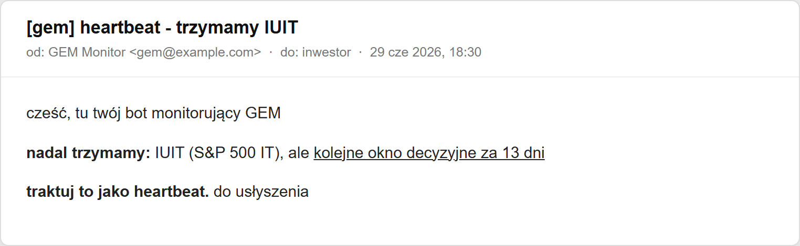
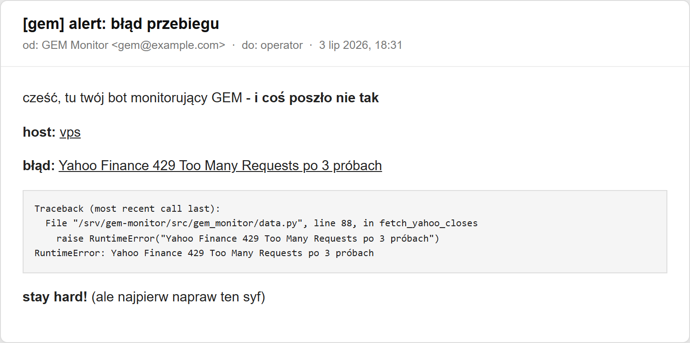
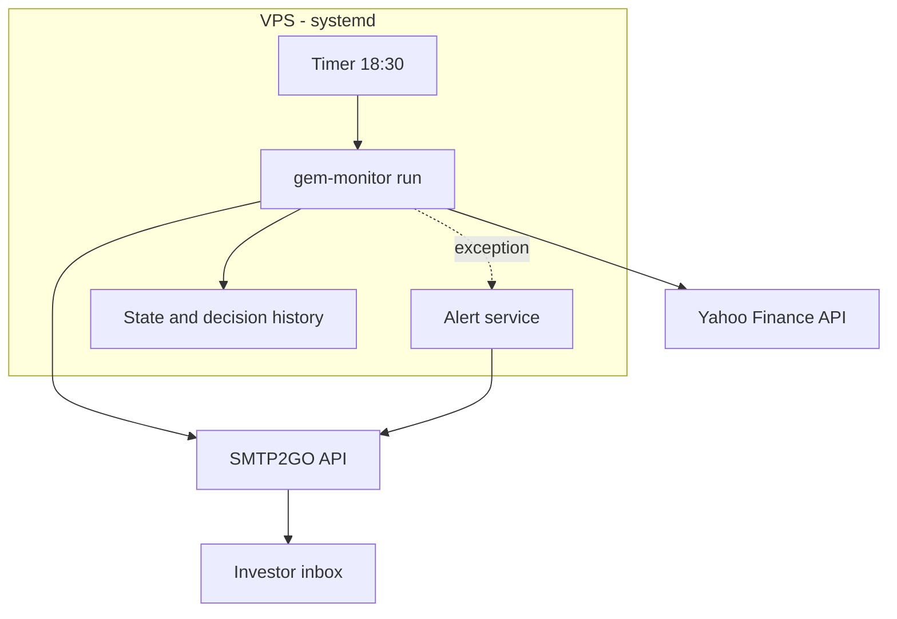

<p align="center"><a href="README.md">Polski</a> | <b>English</b></p>

<p align="center"></p>

<h1 align="center">ETF Portfolio Watchdog</h1>

<h3 align="center">A microservice that scores the 12-month momentum of five ETFs once a month and emails a concrete instruction: hold, add, or rotate. Deployed on my own server, runs unattended.</h3>

<p align="center">
  
  
  
  
  
</p>

---

## Table of contents

- [About](#about)
- [Screenshots](#screenshots)
- [Source code](#source-code)
- [Stack](#stack)
- [Features](#features)
- [Architecture](#architecture)
- [Statistics](#statistics)
- [My role](#my-role)
- [Contact](#contact)

---

## About

An investor holding an ETF portfolio faces the same decision every month: leave the money where it is or move it to the fund with the strongest trend. Momentum strategy says exactly how: compare the 12-month returns of a few funds and switch only when a challenger wins by a clear margin. In practice the decision is easy to postpone, because it means downloading prices, computing results and remembering the calendar. One missed month and the strategy ceases to exist.

The service takes over that discipline. When the observation window closes, the investor gets an email with a results table and an underlined instruction: "sell X and buy Y" or "add to X, no rotation this time". Every week a short heartbeat confirms the watchdog is alive. On failure, an alert goes out with the error details.

I built it in a single day (June 2026) and deployed it on my own server: five funds from the London Stock Exchange, 39 tests, a system scheduler with double alerting. The strategy was validated on full price history in the built-in backtest before going live.

---

## Screenshots

| HOLD email: deadband blocks rotation | Heartbeat: proof the watchdog is alive |
|:---:|:---:|
|  |  |

| Failure alert with error and stack trace |
|:---:|
|  |

> **Note:** the frames are real production email templates with fictional market data. The greeting was neutralized; addresses and real positions are not published. The production emails are in Polish.

---

## Source code

The code is private (it contains server configuration and addresses). This repository documents the project: description, architecture and runtime captures.

---

## Stack

### Engine

```
Python 3.10+ (gem-monitor package)  // src layout, CLI: run / backtest / replay / smoke-email
pandas + pandas_market_calendars    // price series, LSE session calendar (XLON)
Yahoo Finance chart API             // prices, 12 h disk cache, retry on HTTP 429
```

### Reports and deploy

```
SMTP2GO API   // HTML emails: monthly decision, heartbeat, alert
systemd       // 18:30 timer, oneshot service, OnFailure -> separate alert service
pull-deploy   // ssh + git pull + timer restart
```

### Tests

```
pytest (39 tests)  // calendar, strategy, emails, state, data
freezegun          // runner e2e with frozen time
responses          // HTTP mock for Yahoo Finance
```

---

## Features

- **One decision per month, not daily** - the strategy is monthly, so the service tracks the calendar: the observation window is the first Tuesday, Wednesday and Thursday of exchange sessions after the 10th. Checking prices daily would only invite manual tinkering
- **Noise guard (3 pp deadband)** - rotation happens only when a challenger beats the current holding by at least 3 percentage points. Without it the strategy would chase a random leader every month and pay commissions for nothing
- **Three-day average** - momentum is averaged over three consecutive observation sessions. One weird day on the exchange does not move the decision
- **Full table in the email** - the investor sees the scores of all five funds, not just the verdict. The decision can be verified, not just trusted
- **Weekly heartbeat** - silence could mean "no decision" or "service dead". The weekly email settles that unambiguously
- **Double failure alerting** - an error in code sends an email with the stack trace; if the whole process dies, an independent system mechanism sends a second alert. Monitoring cannot die silently
- **Backtest in the package** - month-by-month simulation of full history, comparing two year-counting conventions. The strategy was tested before it went to production

---

## Architecture



---

## Statistics

### Technical complexity

| Metric | Value |
|---|---|
| **Build window** | 1 day (2026-06-20, 6 commits) |
| **Lines of code** | ~2,000 (engine 1,329 + tests 549 + scripts) |
| **Tests** | 39, including e2e with frozen time |
| **Universe** | 5 LSE ETFs in USD |
| **Schedule** | timer daily 18:30; decision once a month, heartbeat once a week |
| **Alerting** | double: code + systemd OnFailure |

### Feature overview

| Category | Highlights |
|---|---|
| **Decisions** | HOLD / CHANGE / INITIAL_BUY, 3 pp deadband, 3-day average |
| **Data** | Yahoo Finance, 12 h cache, retry with backoff |
| **Reports** | monthly email with table, weekly heartbeat, alert with traceback |
| **Ops** | systemd timer, pull-deploy, offline backtest |

---

## My role

All the code is mine: strategy, engine, emails, tests and deploy. The strategy is GEM (Global Equities Momentum) by Gary Antonacci, adapted to a friend investor's portfolio.

---

## Contact

| Platform | Link |
|---|---|
| **WWW** | [kamilkaczmareksolutions.com](https://kamilkaczmareksolutions.com) |
| **GitHub** | [kamilkaczmareksolutions](https://github.com/kamilkaczmareksolutions) |
| **LinkedIn** | [Kamil Kaczmarek](https://www.linkedin.com/in/kamilkaczmareksolutions) |
| **Email** | [recruitment@kamilkaczmareksolutions.com](mailto:recruitment@kamilkaczmareksolutions.com) |

---

**ETF Portfolio Watchdog** - scores momentum once a month, emails an instruction and keeps the strategy from dying of neglect.

<p align="center"><em>Built by Kamil Kaczmarek</em></p>
