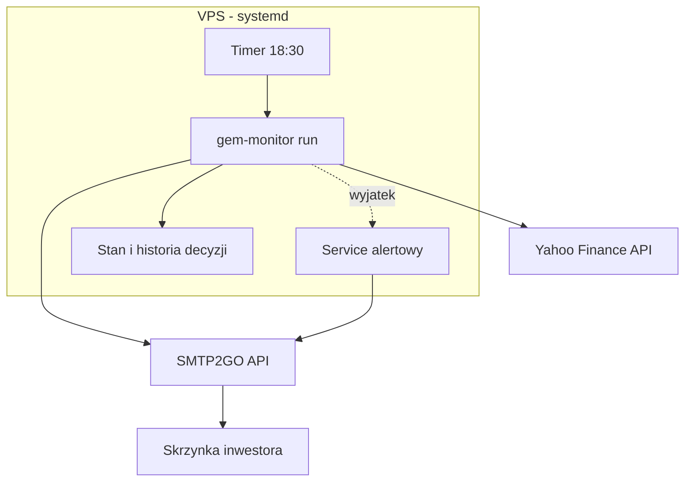

<p align="center"><b>Polski</b> | <a href="README.en.md">English</a></p>

<p align="center"></p>

<h1 align="center">Strażnik portfela ETF</h1>

<h3 align="center">Mikroserwis, który raz w miesiącu liczy momentum pięciu funduszy ETF i wysyła maila z konkretną instrukcją: trzymaj, dokup albo zamień. Wdrożony na własnym serwerze, pracuje bez nadzoru.</h3>

<p align="center">
  
  
  
  
  
</p>

---

## Spis treści

- [O projekcie](#o-projekcie)
- [Screenshoty](#screenshoty)
- [Kod źródłowy](#kod-źródłowy)
- [Stack](#stack)
- [Funkcje](#funkcje)
- [Architektura](#architektura)
- [Statystyki](#statystyki)
- [Moja rola](#moja-rola)
- [Kontakt](#kontakt)

---

## O projekcie

Inwestor z portfelem ETF-ów co miesiąc staje przed tą samą decyzją: zostawić pieniądze tam, gdzie są, czy przesunąć je do funduszu z najsilniejszym trendem. Strategia momentum mówi dokładnie jak: porównaj roczne stopy zwrotu kilku funduszy i zamień tylko wtedy, gdy kandydat wygrywa wyraźnie. W praktyce decyzję łatwo odłożyć, bo wymaga pobrania notowań, policzenia wyników i pamiętania o terminie. Jeden pominięty miesiąc i strategia przestaje istnieć.

Serwis bierze tę dyscyplinę na siebie. Po zamknięciu okna obserwacyjnego inwestor dostaje maila z tabelą wyników i podkreśloną instrukcją: "sprzedaj X i kup Y" albo "dokup X, tym razem bez rotacji". Co tydzień przychodzi krótki heartbeat z potwierdzeniem, że strażnik żyje. Przy awarii leci alert z opisem błędu.

Całość zbudowałem w jeden dzień (czerwiec 2026) i wdrożyłem na własnym serwerze: pięć funduszy z londyńskiej giełdy, 39 testów, harmonogram systemowy z podwójnym alertem. Strategia była wcześniej sprawdzona na pełnej historii notowań w wbudowanym backteście.

---

## Screenshoty

| Mail HOLD: deadband blokuje rotację | Heartbeat: potwierdzenie, że strażnik żyje |
|:---:|:---:|
|  |  |

| Alert awarii z opisem błędu i stosem wywołań |
|:---:|
|  |

> **Nota:** kadry to prawdziwe, produkcyjne szablony maili z fikcyjnymi danymi rynkowymi. Powitanie zneutralizowane; adresy i realne pozycje nie są publikowane.

---

## Kod źródłowy

Kod jest prywatny (zawiera konfigurację serwera i adresy). To repo dokumentuje projekt: opis, architekturę i zrzuty działania.

---

## Stack

### Silnik

```
Python 3.10+ (pakiet gem-monitor) // src-layout, CLI: run / backtest / replay / smoke-email
pandas + pandas_market_calendars  // serie cen, kalendarz sesji LSE (XLON)
Yahoo Finance chart API           // notowania, cache dyskowy 12 h, retry przy HTTP 429
```

### Raporty i deploy

```
SMTP2GO API   // maile HTML: decyzja miesięczna, heartbeat, alert
systemd       // timer 18:30, service oneshot, OnFailure -> osobny service alertowy
pull-deploy   // ssh + git pull + restart timera
```

### Testy

```
pytest (39 testów)  // kalendarz, strategia, maile, stan, dane
freezegun           // e2e runnera z zamrożonym czasem
responses           // mock HTTP dla Yahoo Finance
```

---

## Funkcje

- **Decyzja raz w miesiącu, nie codziennie** - strategia jest miesięczna, więc serwis pilnuje kalendarza: okno obserwacyjne to pierwsze wtorek, środa i czwartek sesji giełdowej po 10. dniu miesiąca. Codzienne sprawdzanie cen rodziłoby tylko pokusę ręcznego kombinowania
- **Blokada przed szumem (deadband 3 pp)** - rotacja tylko wtedy, gdy kandydat bije obecny holding o co najmniej 3 punkty procentowe. Bez tego strategia goniłaby co miesiąc za przypadkowym liderem i płaciła prowizje za nic
- **Średnia z trzech dni** - momentum liczone jako średnia z trzech kolejnych sesji obserwacyjnych. Jeden dziwny dzień na giełdzie nie przesuwa decyzji
- **Pełna tabela w mailu** - inwestor widzi wyniki wszystkich pięciu funduszy, nie tylko werdykt. Decyzja jest do sprawdzenia, nie do uwierzenia
- **Heartbeat co tydzień** - cisza mogłaby znaczyć "brak decyzji" albo "serwis umarł". Cotygodniowy mail rozstrzyga to jednoznacznie
- **Podwójny alert awarii** - błąd w kodzie wysyła maila z opisem i stosem wywołań; gdyby umarł cały proces, niezależny mechanizm systemowy wysyła drugi alert. Monitoring nie może umrzeć po cichu
- **Backtest w pakiecie** - symulacja pełnej historii miesiąc po miesiącu, z porównaniem dwóch konwencji liczenia roku. Strategia była sprawdzona zanim poszła na produkcję

---

## Architektura



---

## Statystyki

### Złożoność techniczna

| Metryka | Wartość |
|---|---|
| **Okno prac** | 1 dzień (2026-06-20, 6 commitów) |
| **Linie kodu** | ok. 2 000 (silnik 1 329 + testy 549 + skrypty) |
| **Testy** | 39, w tym e2e z zamrożonym czasem |
| **Universe** | 5 ETF-ów LSE w USD |
| **Harmonogram** | timer codziennie 18:30; decyzja raz w miesiącu, heartbeat raz w tygodniu |
| **Alertowanie** | podwójne: kod + systemd OnFailure |

### Przegląd funkcji

| Kategoria | Najważniejsze |
|---|---|
| **Decyzje** | HOLD / CHANGE / INITIAL_BUY, deadband 3 pp, średnia z 3 dni |
| **Dane** | Yahoo Finance, cache 12 h, retry z backoffem |
| **Raporty** | mail miesięczny z tabelą, heartbeat tygodniowy, alert z tracebackiem |
| **Ops** | systemd timer, pull-deploy, backtest offline |

---

## Moja rola

Cały kod jest mój: strategia, silnik, maile, testy i deploy. Strategia to GEM (Global Equities Momentum) Gary'ego Antonacciego, zaadaptowana pod portfel znajomego inwestora.

---

## Kontakt

| Platforma | Link |
|---|---|
| **WWW** | [kamilkaczmareksolutions.com](https://kamilkaczmareksolutions.com) |
| **GitHub** | [kamilkaczmareksolutions](https://github.com/kamilkaczmareksolutions) |
| **LinkedIn** | [Kamil Kaczmarek](https://www.linkedin.com/in/kamilkaczmareksolutions) |
| **Email** | [recruitment@kamilkaczmareksolutions.com](mailto:recruitment@kamilkaczmareksolutions.com) |

---

**Strażnik portfela ETF** - raz w miesiącu liczy momentum, wysyła maila z instrukcją i pilnuje, żeby strategia nie umarła z zapomnienia.

<p align="center"><em>Zbudował Kamil Kaczmarek</em></p>
